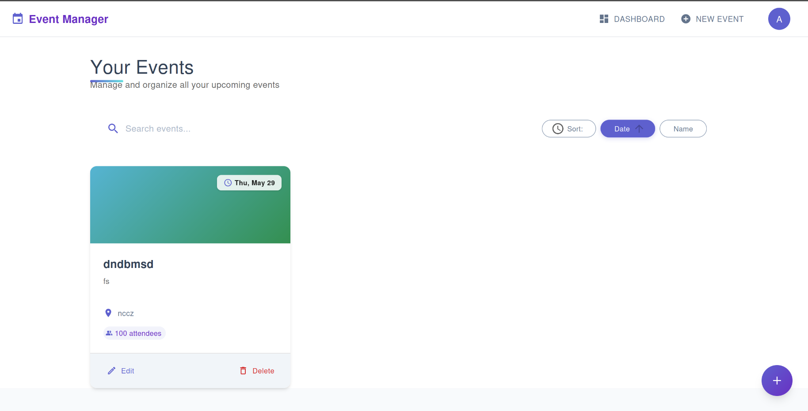
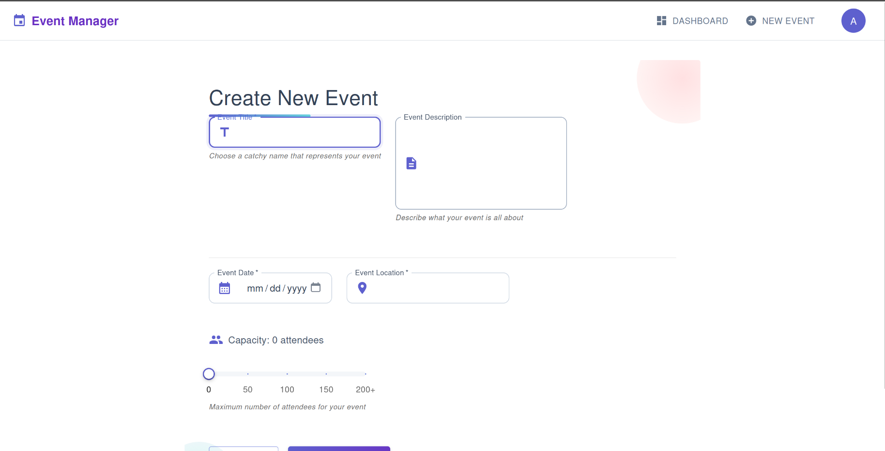
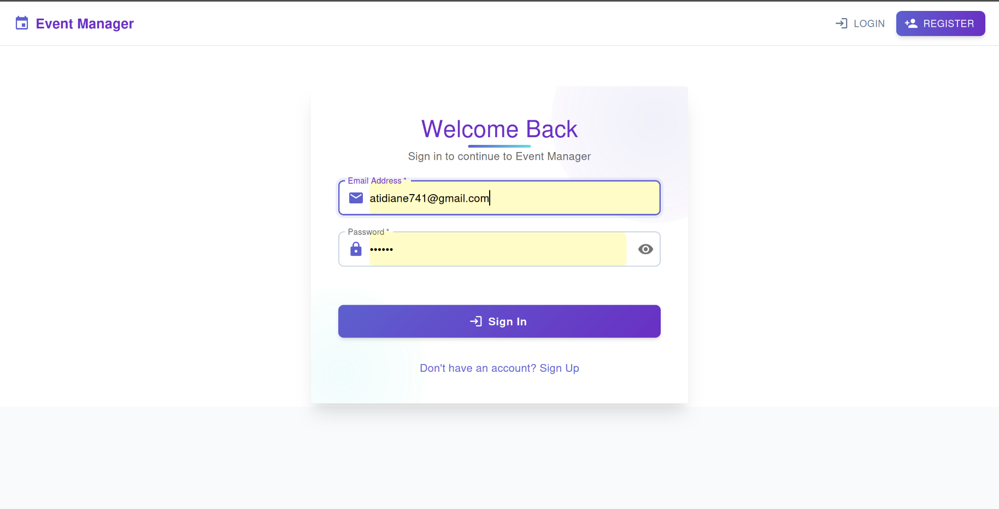
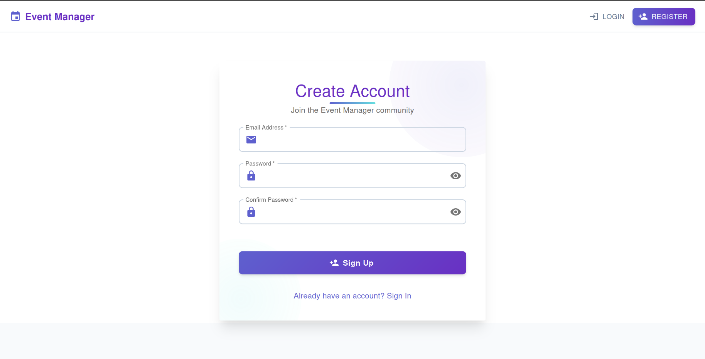

# Event Manager - Plan & Organize Like a Pro


A beautiful, full-stack event management application that lets you create, organize, and track all your events in one gorgeous interface. No more spreadsheets or sticky notes - just smooth, satisfying event planning.

## ✨ Features

- **Stunning UI:** Modern design with animations, gorgeous gradients, and attention to detail
- **User Authentication:** Secure login & registration with JWT tokens
- **Event Management:** Create, edit, view, and delete your events with ease
- **Interactive Dashboard:** Sort, filter, and search through your events
- **Responsive Design:** Looks amazing on everything from phones to desktops
- **API Integration:** Robust backend with RESTful API endpoints

## 🚀 Live Demo

Check out the [live demo](https://eventmanager-demo.example.com) (coming soon)

## 📸 Screenshots

<table>
  <tr>
    <td>
    
</td>
  </tr>
    <td>
    
</td>
  <tr>   
<td>
    
</td>   
<td>
    
</td>
  </tr>
</table>

## 🛠️ Tech Stack

### Frontend
- React with hooks for component logic 
- Material UI with custom styling for the gorgeous interface
- React Router for navigation
- Axios for API calls
- JWT authentication flow

### Backend
- Node.js & Express for the server
- Sequelize ORM with migrations
- PostgreSQL database (configurable)
- JSON Web Tokens (JWT) for authentication
- Jest for testing

## 🏁 Getting Started

Want to run Event Manager locally? Let's do this!

### Prerequisites

- Node.js (v16+)
- npm or yarn
- PostgreSQL database

### Installation

#### Clone the repository
```bash
git clone https://github.com/yourusername/event-manager.git
cd event-manager
```

#### Backend Setup
```bash
cd backend
npm install

# Configure your database
# Edit /config/config.js with your database credentials

# Run migrations
npx sequelize-cli db:migrate

# Start the server
npm run dev
```

The backend API will be available at http://localhost:5000.

#### Frontend Setup
```bash
cd ../frontend
npm install
npm run dev
```

The app will open in your default browser at http://localhost:3000.

## 🔍 Project Structure

### Backend
```
backend/
├── config/         # Configuration files
├── controllers/    # Request handlers
├── middleware/     # Express middleware
├── migrations/     # Database migration files
├── models/         # Sequelize models
├── routes/         # API routes
├── services/       # Business logic
└── server.js       # Entry point
```

### Frontend
```
frontend/
├── public/         # Static assets
└── src/
    ├── components/ # Reusable components
    ├── context/    # React context providers
    ├── pages/      # Page components
    ├── services/   # API service layer
    ├── styles/     # CSS files
    └── App.jsx     # Application entry
```

## Design Principles

Built Event Manager with these principles in mind:

- **Visual Delight:** Thoughtful spacing
- **Intuitive Flow:** Clear pathways for users to accomplish their goals
- **Consistent Design Language:** Cohesive experience across all pages and components
- **Performance First:** Smooth interactions
- **Accessibility:** Designed to be usable by everyone

## 📱 Responsive Behavior

Event Manager looks great on all devices:

- **Desktop:** Full featured interface with expanded navigation 
- **Tablet:** Optimized layout with collapsible sidebar
- **Mobile:** Drawer navigation and stacked controls for the best small-screen experience

## 🔒 API Endpoints

### Authentication
- `POST /api/auth/register` - Create a new user account
- `POST /api/auth/login` - Login and get access token

### Events
- `GET /api/events` - Get all events for current user
- `GET /api/events/:id` - Get a specific event by ID
- `POST /api/events` - Create a new event
- `PUT /api/events/:id` - Update an event
- `DELETE /api/events/:id` - Delete an event

## 🧪 Testing

### Backend
```bash
cd backend
npm test
```

### Frontend
```bash
cd frontend
npm test
```

## 📝 License

This project is licensed under the MIT License - see the LICENSE file for details.

## 💬 Let's Connect

Got questions or feedback? Reach out to me:

- [Email](mailto:atidiane741@gmail.com)

---
